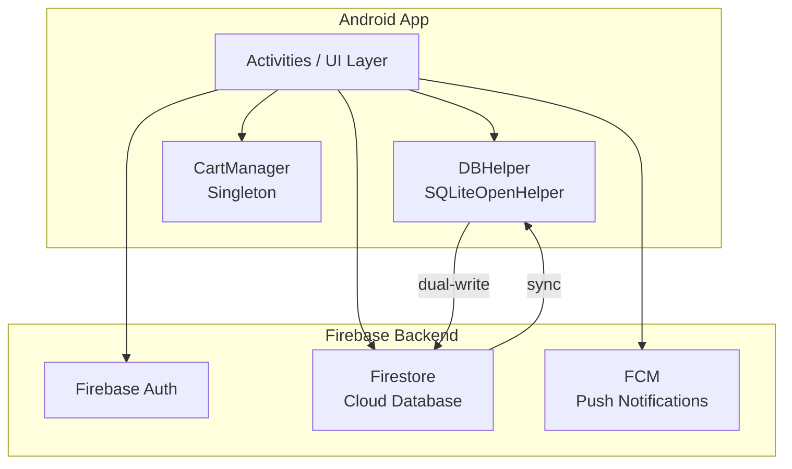
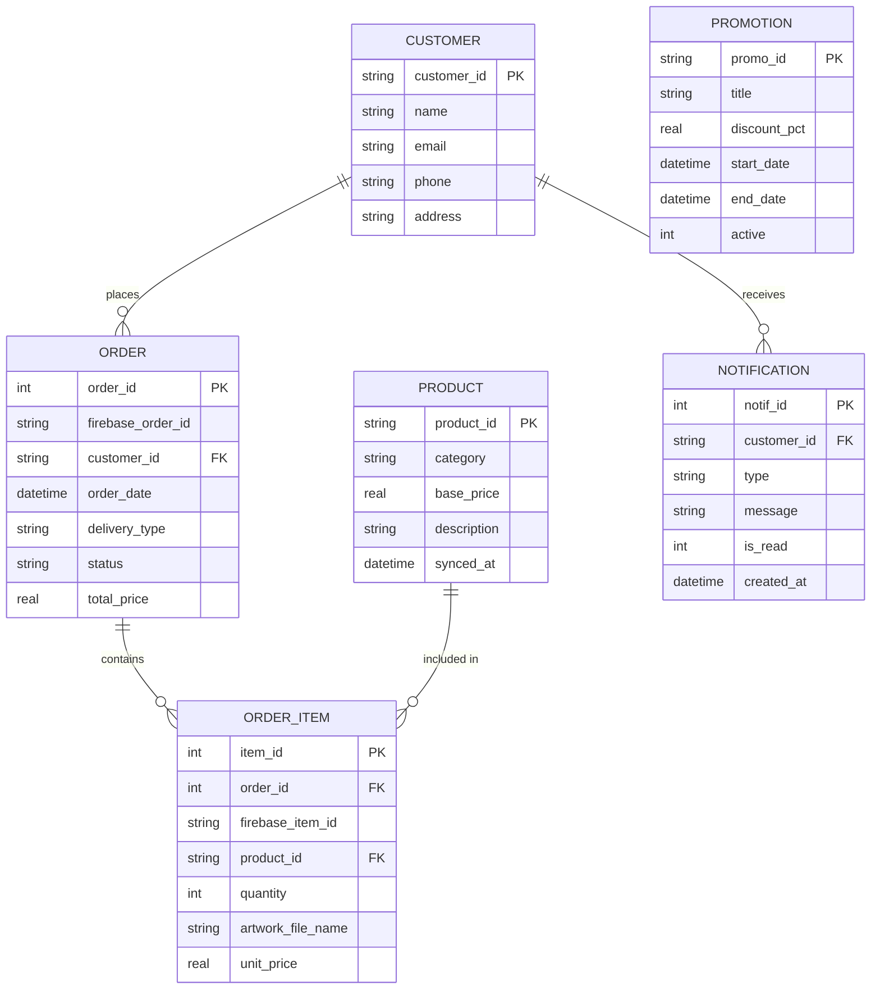
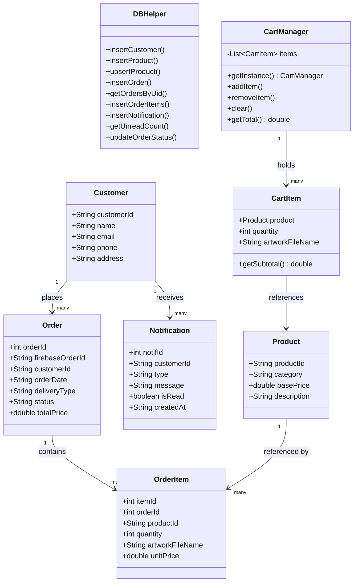
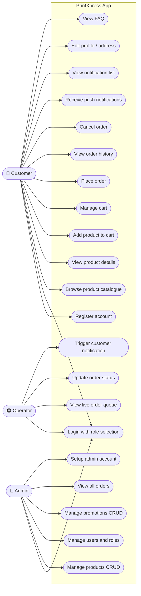
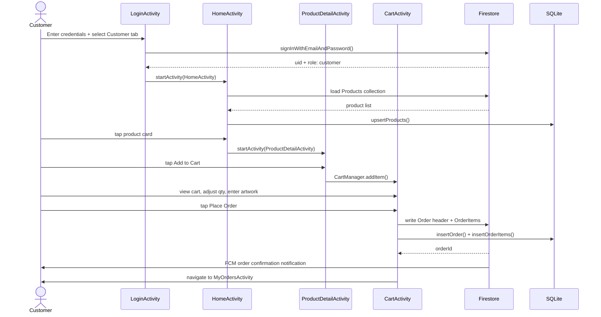
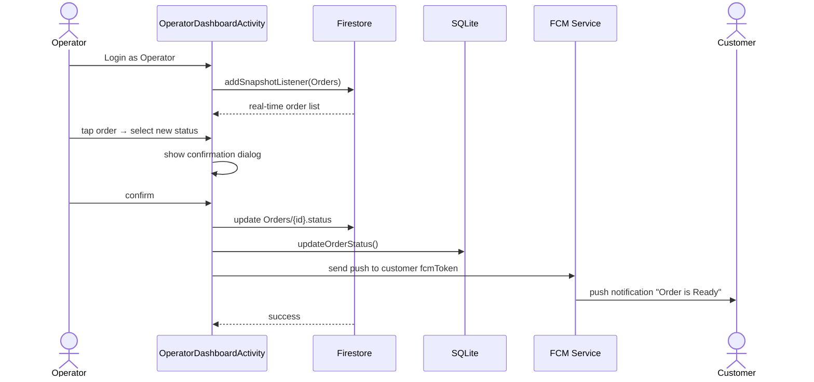
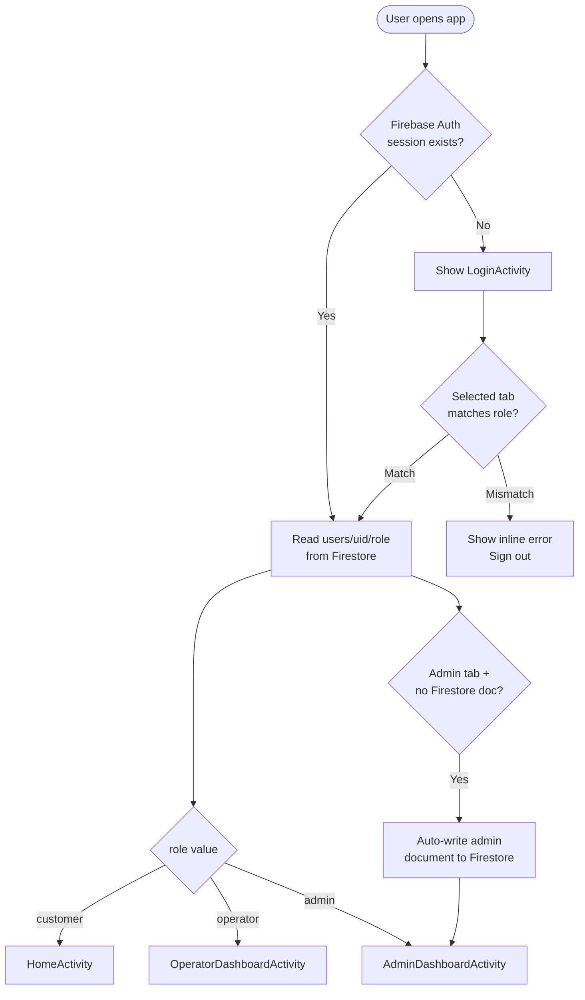
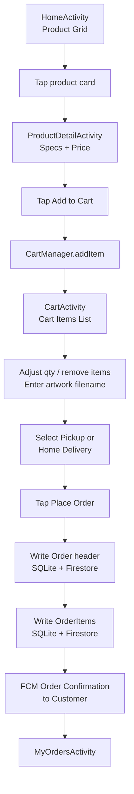
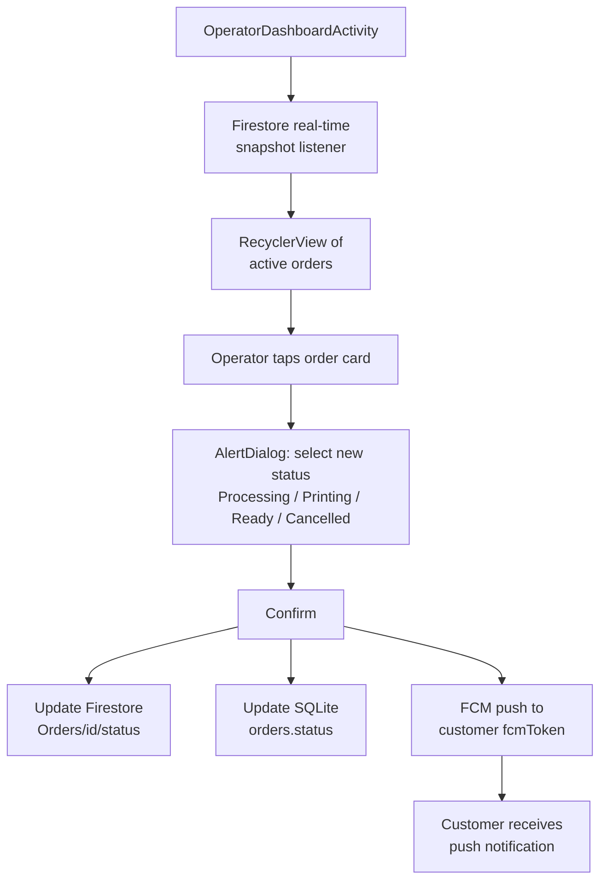
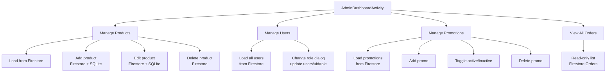

# PrintXpress — Android Application

> **Premium Printing Solutions — B2C Storefront with Role-Based Access**

A native Android application (Java) for a printing services business. Customers browse products, build a cart and place orders. Print Operators manage the fulfilment queue. Admins control the full back-office. All data is stored locally in SQLite and synchronised with Firebase Firestore in real time.

---

## Table of Contents

1. [Project Overview](#project-overview)
2. [Tech Stack](#tech-stack)
3. [Credentials](#credentials)
4. [Site Map](#site-map)
5. [Feature List](#feature-list)
6. [Architecture Overview](#architecture-overview)
7. [ERD — Entity Relationship Diagram](#erd--entity-relationship-diagram)
8. [SQLite Schema](#sqlite-schema)
9. [Firestore Collections](#firestore-collections)
10. [UML Class Diagram](#uml-class-diagram)
11. [UML Use Case Diagram](#uml-use-case-diagram)
12. [UML Sequence Diagrams](#uml-sequence-diagrams)
13. [Role Routing Logic](#role-routing-logic)
14. [Ordering Flow](#ordering-flow)
15. [Operator Flow](#operator-flow)
16. [Admin Flow](#admin-flow)
17. [Project File Structure](#project-file-structure)
18. [Build & Run Instructions](#build--run-instructions)
19. [APK Installation](#apk-installation)
20. [Colour Palette](#colour-palette)

---

## Project Overview

PrintXpress is a cart-based B2C mobile storefront for a printing company. It supports three distinct user roles:

| Role | Access Level | Entry Point |
|---|---|---|
| **Customer** | Browse, cart, order, track | `HomeActivity` |
| **Print Operator** | View & update order queue | `OperatorDashboardActivity` |
| **Admin** | Full back-office control | `AdminDashboardActivity` |

---

## Tech Stack

| Layer | Technology |
|---|---|
| Language | Java (Android SDK 33) |
| Min SDK | API 24 (Android 7.0) |
| UI Framework | Material Design 3 (Material Components 1.9) |
| Local Database | SQLite via `SQLiteOpenHelper` (v9) |
| Cloud Database | Firebase Firestore |
| Authentication | Firebase Authentication (email/password) |
| Push Notifications | Firebase Cloud Messaging (FCM) |
| Build System | Gradle 8.5 with R8 minification |
| Architecture | Single-module, Activity-based MVC |

---

## Credentials

### Customer
Register a new account via the app's **Register** screen. All new accounts default to the `customer` role.

### Admin (Test)
| Field | Value |
|---|---|
| Email | `admin@printxpress.com` |
| Password | `Admin@1234` |
| Setup | Tap the **Admin** tab on the login screen, then tap **"Setup Admin Account"** once. This creates the Firebase Auth user and writes `role: "admin"` to Firestore automatically. |

### Print Operator
An Operator account must be created by the Admin:
1. Log in as Admin
2. Go to **Manage Users**
3. Tap **Add Operator** and enter the operator's email
4. The operator registers normally; Admin then changes their role to `operator` via **Manage Users → Change Role**

---

## Site Map

```
PrintXpress App
│
├── LoginActivity                  ← Launch screen
│   ├── [Customer tab]
│   ├── [Operator tab]
│   └── [Admin tab] → Setup Admin Account button
│
├── RegisterActivity               ← New customer sign-up
│
├── ── CUSTOMER ZONE ──────────────────────────────────────
│
├── HomeActivity                   ← Product grid + promo banner
│   ├── ProductDetailActivity      ← Full product page + Add to Cart
│   ├── CartActivity               ← Cart items, qty edit, checkout
│   ├── MyOrdersActivity           ← Order history + status tracking
│   ├── NotificationsActivity      ← Push notifications list
│   ├── ProfileActivity            ← Account info + address edit
│   └── FAQActivity                ← Frequently asked questions
│
├── ── OPERATOR ZONE ──────────────────────────────────────
│
└── OperatorDashboardActivity      ← Live order queue
│
├── ── ADMIN ZONE ─────────────────────────────────────────
│
└── AdminDashboardActivity         ← Back-office hub
    ├── ManageProductsActivity     ← CRUD products
    ├── ManageUsersActivity        ← View + role management
    ├── ManagePromosActivity       ← Promo banners CRUD
    └── AllOrdersActivity          ← Read-only all-orders view
```

---

## Feature List

### Customer Features
- **Register / Login** with email and password via Firebase Auth
- **Role-based login tabs** — select Customer / Operator / Admin before signing in
- **Inline error alerts** — no popup toasts; errors show inside the form card
- **Product browsing** — grid of product categories loaded from Firestore (cached in SQLite)
- **Product detail page** — full description, specs, price, Add to Cart button
- **Shopping cart** — add multiple items, adjust quantities, remove items, per-item artwork filename
- **Checkout** — choose Pickup or Home Delivery; order written to SQLite + Firestore simultaneously
- **Order history** — view all past orders with item count, total, status chip
- **Order cancellation** — cancel orders in `Processing` status
- **Push notifications** — order confirmation, order ready alerts, promo announcements
- **Notification list** — all notifications stored locally; unread badge on nav icon
- **Profile page** — view name, email, phone, delivery address; edit address
- **FAQ page** — static frequently asked questions
- **Password visibility toggle** — on all password fields

### Operator Features
- **Live order queue** — real-time Firestore listener shows all active orders
- **Status update** — tap any order card to update status (Processing → Printing → Ready → Cancelled)
- **Dual-write sync** — status change updates both Firestore and local SQLite
- **Customer notification trigger** — FCM push sent to customer on every status change

### Admin Features
- **Manage Products** — Add, Edit, Delete products in Firestore; synced to customer SQLite caches
- **Manage Users** — view all registered users, change user roles (customer ↔ operator)
- **Manage Promotions** — Add promo banners with discount %, start/end dates; toggle active state; delete
- **View All Orders** — read-only list of every order across all customers
- **Admin auto-setup** — one-tap admin account creation from the login screen

### Security & Performance
- **Role mismatch protection** — login fails if selected tab doesn't match Firestore role
- **R8 minification + resource shrinking** — release APK is ~4 MB
- **Firestore offline persistence** — app works with cached data when offline
- **No AI service dependencies** — fully self-contained; no third-party AI APIs

---

## Architecture Overview



**Data flow:** Firestore is the source of truth. On first load or sync, data is written to SQLite. All UI reads from SQLite for speed. All writes go to both SQLite and Firestore simultaneously (dual-write).

---

## ERD — Entity Relationship Diagram



---

## SQLite Schema

Database name: `PrintXpress.db` — Version: `9`

### Table: `customers`
| Column | Type | Constraints |
|---|---|---|
| `customer_id` | TEXT | PRIMARY KEY (= Firebase Auth UID) |
| `name` | TEXT | NOT NULL |
| `email` | TEXT | NOT NULL |
| `phone` | TEXT | |
| `address` | TEXT | |

### Table: `products`
| Column | Type | Constraints |
|---|---|---|
| `product_id` | TEXT | PRIMARY KEY (= Firestore doc ID) |
| `category` | TEXT | |
| `base_price` | REAL | |
| `description` | TEXT | |
| `synced_at` | DATETIME | |

### Table: `orders`
| Column | Type | Constraints |
|---|---|---|
| `order_id` | INTEGER | PRIMARY KEY AUTOINCREMENT |
| `firebase_order_id` | TEXT | |
| `customer_id` | TEXT | FOREIGN KEY → customers(customer_id) |
| `order_date` | DATETIME | |
| `delivery_type` | TEXT | `Pickup` or `Home Delivery` |
| `status` | TEXT | `Processing` / `Printing` / `Ready` / `Cancelled` |
| `total_price` | REAL | |

### Table: `order_items`
| Column | Type | Constraints |
|---|---|---|
| `item_id` | INTEGER | PRIMARY KEY AUTOINCREMENT |
| `order_id` | INTEGER | FOREIGN KEY → orders(order_id) |
| `firebase_item_id` | TEXT | |
| `product_id` | TEXT | FOREIGN KEY → products(product_id) |
| `quantity` | INTEGER | |
| `artwork_file_name` | TEXT | |
| `unit_price` | REAL | Snapshot at order time |

### Table: `notifications`
| Column | Type | Constraints |
|---|---|---|
| `notif_id` | INTEGER | PRIMARY KEY AUTOINCREMENT |
| `customer_id` | TEXT | |
| `type` | TEXT | `order_confirmation` / `order_completion` / `promo` |
| `message` | TEXT | |
| `is_read` | INTEGER | `0` = unread, `1` = read |
| `created_at` | DATETIME | |

---

## Firestore Collections

| Collection Path | Purpose | Key Fields |
|---|---|---|
| `users/{uid}` | User profile + role | `name, email, phone, address, role, fcmToken` |
| `Products/{id}` | Product catalogue | `category, basePrice, description, specs[]` |
| `Orders/{id}` | Order header | `customerId, orderDate, deliveryType, status, totalPrice` |
| `Orders/{id}/items/{itemId}` | Order line items | `productId, quantity, artworkFileName, unitPrice` |
| `Promotions/{id}` | Promo banners | `title, discountPct, startDate, endDate, active` |
| `Notifications/{id}` | Push notification log | `userId, type, message, isRead, createdAt` |

---

## UML Class Diagram



---

## UML Use Case Diagram



---

## UML Sequence Diagrams

### Customer Places an Order



### Operator Updates Order Status



---

## Role Routing Logic



---

## Ordering Flow



---

## Operator Flow



---

## Admin Flow



---

## Project File Structure

```
app/src/main/
│
├── java/com/example/printxpress/
│   │
│   ├── ── Models ──────────────────────────
│   ├── Customer.java
│   ├── Product.java
│   ├── Order.java
│   ├── OrderItem.java
│   ├── Notification.java
│   ├── CartItem.java
│   │
│   ├── ── Database ────────────────────────
│   ├── DBHelper.java              (SQLite, 5-table schema, v9)
│   ├── CartManager.java           (Singleton in-memory cart)
│   │
│   ├── ── Customer Activities ─────────────
│   ├── LoginActivity.java
│   ├── RegisterActivity.java
│   ├── HomeActivity.java
│   ├── ProductDetailActivity.java
│   ├── CartActivity.java
│   ├── MyOrdersActivity.java
│   ├── NotificationsActivity.java
│   ├── ProfileActivity.java
│   ├── FAQActivity.java
│   │
│   ├── ── Operator Activities ─────────────
│   ├── OperatorDashboardActivity.java
│   │
│   ├── ── Admin Activities ────────────────
│   ├── AdminDashboardActivity.java
│   ├── ManageProductsActivity.java
│   ├── ManageUsersActivity.java
│   ├── ManagePromosActivity.java
│   ├── AllOrdersActivity.java
│   │
│   ├── ── Adapters ────────────────────────
│   ├── CartAdapter.java
│   ├── OrderAdapter.java
│   ├── NotificationAdapter.java
│   ├── OperatorOrderAdapter.java
│   │
│   ├── ── Services ────────────────────────
│   ├── MyFirebaseMessagingService.java
│   └── PrintXpressApp.java        (Application class, Firestore offline)
│
├── res/
│   ├── layout/                    (20 XML layout files)
│   ├── drawable/                  (icons + shape drawables)
│   └── values/
│       ├── colors.xml
│       ├── themes.xml
│       └── strings.xml
│
└── AndroidManifest.xml
```

---

## Build & Run Instructions

### Requirements
- Android Studio Hedgehog or newer
- JDK 11+
- `google-services.json` placed in `app/` directory (from Firebase Console)

### Debug Build (USB)
```bash
./gradlew installDebug
```

### Release APK
```bash
./gradlew assembleRelease
```
Output: `app/build/outputs/apk/release/app-release.apk`

The release keystore is at `app/printxpress-release.jks`:
| Field | Value |
|---|---|
| Store password | `PrintXpress2024` |
| Key alias | `printxpress` |
| Key password | `PrintXpress2024` |

---

## APK Installation

1. Copy `PrintXpress.apk` to the target Android device
2. Open the file using a file manager
3. If prompted, enable **"Install from unknown sources"** for the file manager app
4. Tap Install

**Requirements:** Android 7.0+ (API 24), internet connection for Firebase

---

## Colour Palette

| Token | Hex | Usage |
|---|---|---|
| `primary` | `#0F766E` | Buttons, active tabs, icons |
| `primary_dark` | `#0B544E` | Header gradient start |
| `secondary` | `#0EA5E9` | Accent, links |
| `background` | `#F4F7F7` | Screen backgrounds |
| `surface` | `#FFFFFF` | Cards |
| `text_primary` | `#1B2B2A` | Headings, body text |
| `text_secondary` | `#5F7371` | Subtitles, hints |
| `success` | `#2E7D32` | Ready status, confirmations |
| `warning` | `#B7791F` | Admin cred card, caution |
| `error` | `#C62828` | Inline error banner |
